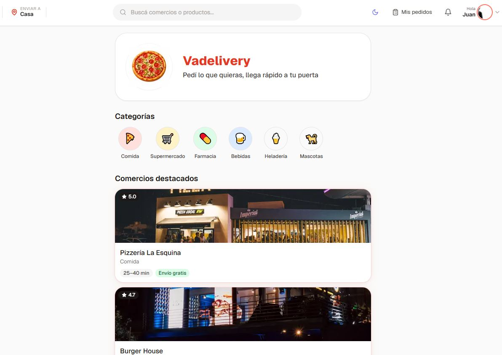
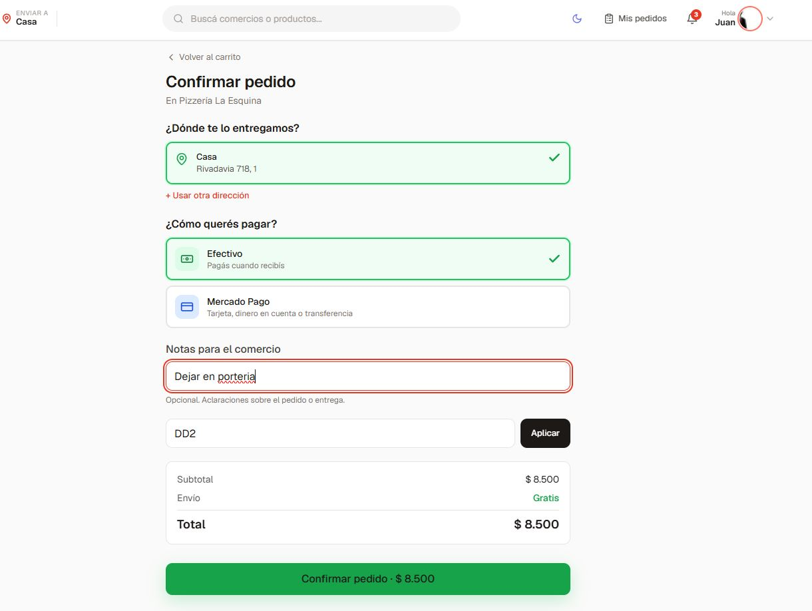

# Vadelivery

[](https://github.com/Juanmd14/vadelivery/actions/workflows/ci.yml)
[](https://nextjs.org/)
[](https://www.typescriptlang.org/)
[](https://supabase.com/)
[](https://tailwindcss.com/)
[](https://www.mercadopago.com.ar/developers)
[](./LICENSE)

🇪🇸 **Español** · [🇺🇸 English](./README.en.md)

> 🌐 **Demo en vivo**: [vadelivery.vercel.app](https://vadelivery.vercel.app)

Plataforma de delivery local tipo PedidosYa/Rappi para una ciudad pequeña.
Stack: **Next.js 14 (App Router) · Supabase · PostgreSQL · TailwindCSS · TypeScript · Vercel**.

## 🖼️ Capturas

<p align="center">
  
  
</p>

---

## 🚀 Cómo arrancar (15 minutos)

### 1. Requisitos
- Node.js 20+
- pnpm (`npm i -g pnpm`)
- Cuenta gratis en [Supabase](https://supabase.com)
- Cuenta de testing en [Mercado Pago Developers](https://www.mercadopago.com.ar/developers)

### 2. Instalar
```bash
pnpm install
cp .env.example .env.local
```

### 3. Crear proyecto en Supabase
1. https://supabase.com/dashboard → **New project**
2. Settings → API → copiar Project URL, anon key y service_role key a `.env.local`

### 4. Aplicar el schema
SQL Editor → New query → pegar `supabase/schema.sql` → Run.
Después correr `supabase/seed/seed.sql` para datos demo.

### 5. Configurar Auth
- Authentication → Providers → habilitar **Email** (provider OTP).
- Authentication → URL Configuration → Site URL: `http://localhost:3000`.
- Authentication → Email Templates → opcional: traducir el copy.

### 6. Configurar Mercado Pago
- En el panel de developers MP, crear una aplicación.
- Copiar `MP_ACCESS_TOKEN` y `MP_PUBLIC_KEY` a `.env.local` (usar credenciales TEST).
- Para webhooks en local: usar **ngrok** (`ngrok http 3000`) y configurar `https://XXX.ngrok.io/api/webhooks/mercadopago` en MP → Webhooks → seleccionar evento "Pagos".
- Copiar el secret de webhook a `MP_WEBHOOK_SECRET`.

### 7. Generar tipos y arrancar
```bash
pnpm db:types
pnpm dev
```

---

## 🧠 Arquitectura

Las decisiones de diseño (stack, seguridad, idempotencia de webhooks, realtime, trade-offs conocidos) están explicadas en [**docs/ARCHITECTURE.md**](./docs/ARCHITECTURE.md).

---

## ✅ Bloques implementados

### Bloque 1 — Base + diseño
- Estructura completa de carpetas, route groups
- Sistema de diseño: paleta coral + acento verde + neutros stone, tipografía Geist
- Schema SQL completo (13 migraciones, RLS por rol, RPC idempotente)
- Seed con 5 comercios + 25 productos demo
- Home, ficha comercio (catálogo SSR + ISR), 404, error boundary
- Componentes shop: StoreCard, ProductCard, CategoryPill, PromoBanner

### Bloque 2 — Auth + Onboarding
- Login passwordless con OTP de 6 dígitos
- Helpers de sesión y RBAC (`getSession`, `requireAuth`, `requireRole`)
- next-safe-action con `action`, `authAction`, `adminAction`
- Onboarding del comercio en 5 pasos: datos → dirección → operación → productos → publicar
- Layout panel con sidebar (desktop) + bottom nav (móvil)
- Server Actions: stores, products

### Bloque 3 — Carrito
- Zustand store persistido en localStorage
- Lógica de "carrito por comercio único" (modal de switch)
- ProductCard con add to cart + animación de feedback
- Página de carrito con resumen, control de cantidades, validación de mínimo
- CartFloatingButton sticky

### Bloque 4 — Checkout + Mercado Pago + Tracking
- **Pricing service**: cálculo de subtotal/total/comisión del lado server
- **createOrderAction**: crea pedido validando productos reales (no confía en cliente)
- **CheckoutForm**: dirección + método pago + notas, en una pantalla
- **Mercado Pago Service**: crea preferencia, mapea status MP → enum interno
- **Webhook MP**: route handler en `/api/webhooks/mercadopago` que re-consulta el pago a MP y aplica la actualización vía RPC idempotente (verificación HMAC pendiente — detalle en [ARCHITECTURE.md](./docs/ARCHITECTURE.md))
- **RPC `apply_payment_webhook`**: idempotente, actualiza pago + orden + crea delivery
- **OrderTracker**: stepper visual de 5 pasos con animaciones
- **useOrderRealtime**: hook que suscribe a cambios de orden vía Supabase Realtime
- **Página `/pedido/[id]`**: tracking en vivo + detalle completo + contacto comercio
- **Acciones del comercio**: aceptar / marcar listo / rechazar pedido

---

## 🔜 Próximos bloques

- **Panel KDS del comercio**: Kanban con pedidos en vivo (Realtime), botones de aceptar/rechazar/listo
- **App del repartidor**: tomar pedidos disponibles, geolocalización, marcar estados
- **Tracking del repartidor en mapa**: Realtime broadcast cliente↔cliente
- **Notificaciones**: email transaccional con Resend, push web, WhatsApp para confirmación
- **Panel admin**: gestión de comercios, repartidores, finanzas, comisiones
- **Página de productos del comercio (panel)**: CRUD con drag & drop

---

## 📁 Estructura

```
src/
├── app/
│   ├── (auth)/                    Login + registro (OTP)
│   ├── (shop)/                    Marketplace cliente final
│   │   ├── page.tsx               Home
│   │   ├── s/[storeSlug]/         Ficha de comercio
│   │   ├── carrito/
│   │   ├── checkout/              ← bloque 4
│   │   └── pedido/[id]/           ← bloque 4 (tracking)
│   ├── (account)/                 Zona logueada del cliente
│   ├── comercio/
│   │   ├── onboarding/            5 pasos
│   │   └── (panel)/               Panel principal
│   ├── driver/                    App del repartidor
│   ├── admin/
│   └── api/webhooks/mercadopago/  ← bloque 4
│
├── components/
│   ├── ui/                        button, input, label, switch, form-field
│   ├── shop/                      store-card, product-card, category-pill, promo-banner
│   ├── cart/                      cart-floating-button
│   ├── checkout/                  checkout-form ← bloque 4
│   ├── order/                     order-tracker, order-tracker-live ← bloque 4
│   ├── store-admin/               onboarding-{stepper,basic,address,operation,products,publish}
│   └── shared/                    shop-header, bottom-nav, login-form
│
├── server/
│   ├── auth/session.ts
│   ├── actions/
│   │   ├── safe-action.ts         clients
│   │   ├── auth.ts
│   │   ├── stores.ts
│   │   ├── products.ts
│   │   └── orders.ts              ← bloque 4
│   └── services/
│       ├── pricing.service.ts     ← bloque 4
│       └── mercadopago.service.ts ← bloque 4
│
├── lib/
│   ├── supabase/                  client, server, admin
│   └── utils.ts
│
├── stores/cart.ts                 Zustand
├── schemas/                       Zod
├── hooks/use-order-realtime.ts    ← bloque 4
├── styles/globals.css
└── middleware.ts

supabase/
├── migrations/                    13 archivos
├── schema.sql                     concatenado
├── seed/seed.sql                  5 comercios + 25 productos
└── config.toml
```

---

## 🔄 Flujo end-to-end del pedido

1. Cliente arma carrito → `/checkout`
2. Confirma → `createOrderAction`:
   - Trae productos reales de la BD (no confía en precios del cliente)
   - Aplica promoción si vino código
   - Calcula pricing server-side
   - Inserta `orders` + `order_items` + `payments` (status `pending`)
3. Si **efectivo** → status `pending` → comercio acepta y pasa a `preparing`
4. Si **Mercado Pago**:
   - Crea preferencia con `external_reference = order.id`
   - Redirige al `init_point`
   - Cliente paga en MP
   - Webhook `/api/webhooks/mercadopago` recibe notificación
   - `getPayment(id)` contra MP para confirmar el pago (HMAC pendiente)
   - Llama RPC `apply_payment_webhook` (idempotente):
     - Upsert en `payments` por `mp_payment_id`
     - Si `approved` → `orders.payment_status='approved'`, `status='confirmed'`, crea fila `deliveries`
5. Comercio acepta → `preparing` → `ready`
6. Repartidor toma → `picked_up` → `delivered` → `completed`
7. Realtime: el cliente ve los cambios en `/pedido/[id]` sin refrescar

---

## 🎨 Sistema de diseño

| Token | Hex | Uso |
|---|---|---|
| `primary-500` | #FF4D3A | Marca |
| `primary-600` | #E63823 | CTAs |
| `accent-500` | #22C55E | Envío gratis, success |
| `warning-500` | #F59E0B | Promos % off |
| `neutral-900` | #1C1917 | Títulos |
| `neutral-500` | #78716C | Texto secundario |

Tipografía: **Geist**. Mobile-first: container `max-w-screen-sm`.

---

## 🔑 Roles

| Rol | Puede |
|---|---|
| `customer` | Navegar, pedir, ver sus pedidos, cancelar antes de aceptación |
| `store_owner` | Todo lo de su comercio + aceptar/rechazar/marcar listo |
| `store_staff` | Lo permitido en `store_users` |
| `delivery_driver` | Tomar pedidos disponibles, marcar estados |
| `admin` | Todo |

RLS aplica reglas a nivel BD. Mutaciones críticas vía Server Action con `service_role` previa validación de permisos.

---

## 📦 Scripts

```bash
pnpm dev          # next dev
pnpm build        # next build
pnpm lint
pnpm type-check
pnpm db:types     # regenera src/types/database.types.ts
pnpm db:seed      # corre seed.sql
```

---

## 🐛 Debug Mercado Pago

- **Sandbox**: usar credenciales TEST y la cuenta de comprador de test (creada en MP Developers).
- **Webhook local**: `ngrok http 3000` y pegar la URL HTTPS en MP → Webhooks.
- **Idempotencia**: borrar `payments` con el mismo `mp_payment_id` para reproducir.

---

## 📚 Variables de entorno

```
NEXT_PUBLIC_APP_URL=http://localhost:3000
NEXT_PUBLIC_APP_NAME=Vadelivery
NEXT_PUBLIC_SUPABASE_URL=https://XXX.supabase.co
NEXT_PUBLIC_SUPABASE_ANON_KEY=eyJ...
SUPABASE_SERVICE_ROLE_KEY=eyJ...
MP_ACCESS_TOKEN=TEST-...
MP_PUBLIC_KEY=TEST-...
MP_WEBHOOK_SECRET=tu_secret
```

---

## 👤 Autor

**Juan M.** — Desarrollador full-stack enfocado en producto.

- GitHub: [@Juanmd14](https://github.com/Juanmd14)

Proyecto construido como caso end-to-end: arquitectura, datos, auth, pagos, realtime y UX, manteniendo el stack acotado a herramientas de producción reales.

---

## 📄 Licencia

[MIT](./LICENSE) © 2026 Juan M.
