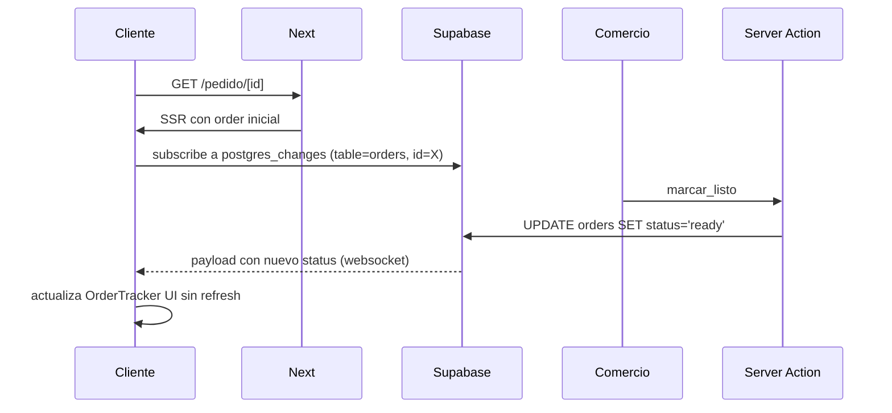

# Arquitectura

Documento corto sobre **por qué** las decisiones técnicas, no qué hace cada parte (eso está en el README).

---

## 1. Stack: por qué Next 14 + Supabase + Mercado Pago

| Necesidad | Elección | Por qué |
|---|---|---|
| Frontend + SSR + API en un proceso | **Next.js App Router** | Server Components reducen JS al cliente; Server Actions evitan armar una capa REST/GraphQL para mutaciones internas. |
| Postgres + Auth + Realtime + Storage | **Supabase** | Es Postgres real (no una abstracción propia). Puedo escribir SQL plano y migrar a un Postgres propio si crece. |
| Pagos en Argentina | **Mercado Pago** | Es la única opción realista para el mercado objetivo (PYMEs de ciudad chica). |
| Hosting | **Vercel** | Adyacente a Next, edge runtime para webhooks y OG image. |

Trade-off consciente: el stack queda atado a 3 proveedores. Mitigado porque Supabase = Postgres puro (portable) y MP es sólo el provider de pagos (intercambiable por Stripe con una capa fina).

---

## 2. Seguridad: defensa en profundidad

No hay un solo punto de control. Hay tres capas:

```
Cliente  →  Server Action  →  Supabase (RLS)  →  Postgres
            ↓                ↓
            valida          valida segunda
            con Zod         vez por rol
```

- **Cliente**: sólo dispara la intención. Nunca confío en lo que mande.
- **Server Action** (`next-safe-action`): valida con Zod (`src/schemas/`), aplica auth/role check (`requireAuth`, `requireRole`), y recién después llama a Supabase con el `service_role`.
- **RLS en Postgres**: aunque alguien filtrara una key, las policies del role bloquean datos que no le tocan. Definidas en `supabase/migrations/*`.

### Auth pasworless con OTP
Decidí **no** usar password porque:
- Un solo factor (email + código de 6 dígitos) reduce vectores de phishing
- Onboarding más simple para usuarios no técnicos del público objetivo
- Supabase Auth ya implementa rate-limiting y rotación de tokens

**SMTP — limitación conocida.** El envío del OTP va por Brevo SMTP sobre un subdominio compartido (`vadelivery2026@<id>.brevosend.com`). Funciona y entrega correctamente, pero el "From" visible no es un dominio propio. En producción real, comprar un dominio + configurar DKIM/SPF/DMARC en Brevo deja el sender como `noreply@traeapp.com` y mejora entregabilidad (evita el greylisting que Gmail aplica a senders nuevos sin firma de dominio).

---

## 3. Order pricing: el cliente no puede mentir

Problema: si calculo el total en el cliente, un usuario malicioso puede modificar el JS y mandar `total = 1`.

Solución (`src/server/services/pricing.service.ts`):

```
1. Cliente manda: { storeId, items: [{ productId, quantity }] }
2. Server lee productos REALES de la BD por sus IDs
3. Server suma usando los precios de la BD, no los del cliente
4. Server aplica fees/promociones server-side
5. Server inserta orders + order_items + payments en una transacción
```

El cliente nunca pasa precios. Los `compareAtPrice` y descuentos son visuales pero el cálculo definitivo es server-only.

---

## 4. Webhooks: idempotencia (HMAC pendiente)

Mercado Pago puede mandar el mismo webhook varias veces (reintentos, timeouts). La defensa principal hoy es la idempotencia en BD:

**Idempotencia vía RPC de Postgres** (`apply_payment_webhook`):
- Hace `INSERT ... ON CONFLICT (mp_payment_id) DO UPDATE`
- Sólo crea la fila `deliveries` si el estado pasa a `approved` por primera vez
- Si MP manda 5 veces el mismo evento `approved`, el resultado final es idéntico al de 1 sola vez

**Verificación HMAC-SHA256 — pendiente.** En el código actual (`src/app/api/webhooks/mercadopago/route.ts`) hago `getPayment(id)` contra la API de MP para confirmar el estado, lo cual mitiga el riesgo de inyección (un atacante necesitaría el `paymentId` real Y ese pago real debería estar en MP). Pero el path seguro es validar el header `x-signature`:

```
expected = HMAC_SHA256(secret, `id:${paymentId};request-id:${reqId};ts:${ts};`)
if (expected !== v1FromHeader) return 401
```

Lo voy a implementar en el próximo bloque (Block 5). Es 30 líneas de código, sólo no quise mezclarlo con la primera versión del flujo.

---

## 5. Realtime tracking



Por qué `postgres_changes` y no polling:
- Sub-segundo de latencia vs 5-10s de polling
- Una sola conexión persistente vs N requests por minuto
- Supabase Realtime es gratis hasta 200 conexiones concurrentes (más que suficiente para una ciudad chica)

Hook reutilizable: `src/hooks/use-order-realtime.ts`.

---

## 6. Qué haría distinto en producción real

Soy consciente de lo que falta para pasar de "MVP funcional" a "producción seria":

| Área | Cómo está | Cómo debería estar |
|---|---|---|
| Tests | No hay (planificado: utils + schemas con Vitest) | Cobertura mínima 60% en lógica server, e2e con Playwright para checkout |
| Observabilidad | `console.error` en webhook | Sentry o axiom para errores; structured logs con request-id |
| Rate limiting | Ninguno custom (sólo el de Supabase Auth) | `@upstash/ratelimit` en checkout y webhooks |
| Backups | Auto de Supabase | Snapshot diario propio + restore drill mensual |
| Secrets | Plain env vars | Vault/Doppler con rotación |
| Webhook retry | Confío en los retries de MP | DLQ propio para eventos que fallan después de N intentos |
| Pagos | Sólo MP | Adapter pattern para sumar Stripe/Modo |

Lo importante: **ninguno de estos es bloqueante para validar la idea de producto**. Son cosas que se agregan cuando hay tráfico real que las justifique.
